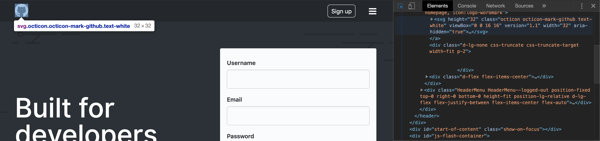
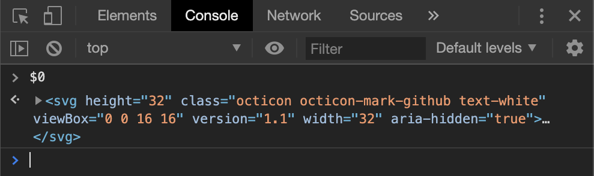
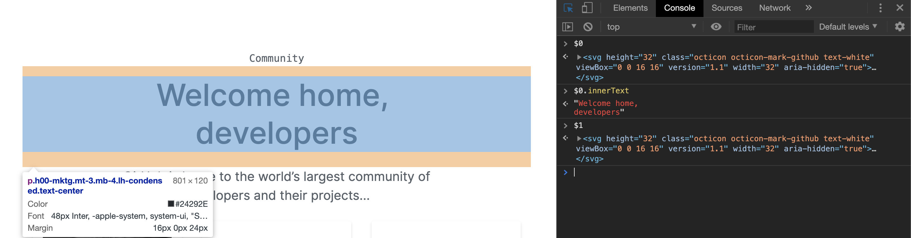
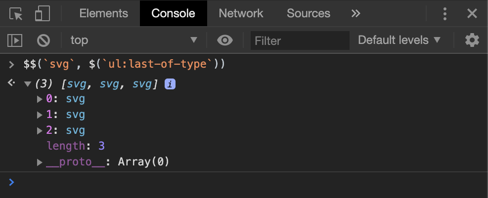
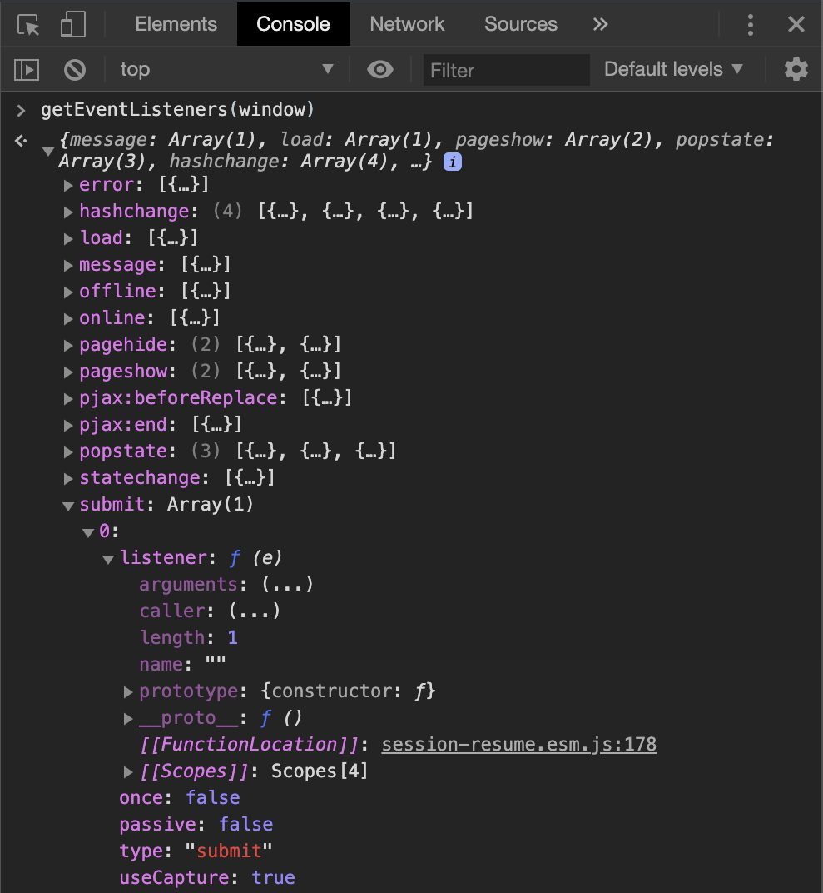
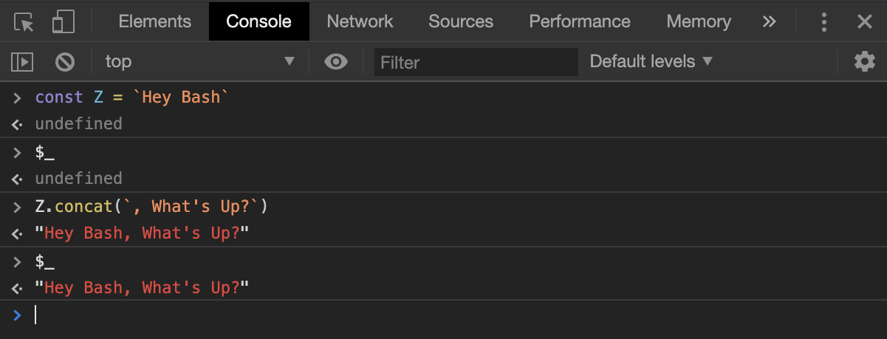
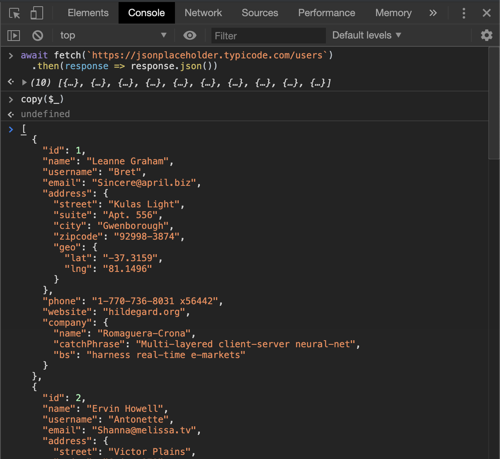

Chromium-based browsers like Google Chrome, Brave and [now even Microsoft Edge][1] come pre-packed with a suite of convenient utilities available in JavaScript console panel. They have proven helpful to me over the years, and in this short article I'd like to make an overview of the ones I find myself using quite frequently.

## Get the last element touched by the DOM Inspector

There is a special variable which holds a reference to the most recently selected node within the **Elements** panel - `$0`. To illustrate, let's say we wanted to take a peek at Octocat logo's underlying DOM definition on [GitHub][2] (micro-tip: you can quickly access **Inspector** tool by pressing `Cmd+Shift+C`):



Now, if we switch over to the **Console** panel and evaluate `$0`, it's going to yield us what we just picked few moments ago:



If we went on to select a different DOM node, it would become the new value of `$0`. However, previous one still remains available, although at a different location - `$1`:



Console is capable of holding up to 5 such references (`$0` through `$4`). It's worth mentioning that these variables could also be leveraged when analyzing JS performance - in this context, they will store last five heap objects.

## Query the DOM quicker

Even though DOM elements could be retrieved by calling either `document.querySelector` or `document.querySelectorAll`, I often opt into using their aliases instead - `$` and `$$` respectively. They are actually enhanced versions of the said methods as you can specify an entry point for your search - it doesn't have to always be `document`, which is the default:

```javascript
$(selector, [(startNode: document)]);
```



## Fetch all event listeners

With the help of this utility you can get a list of all event listeners attached to the given DOM node. It returns an object with all events conveniently grouped under respective keys. Nifty, eh?

```javascript
getEventListeners(EventTarget);
```



## Get result of the last evaluated expression

In order to get hold of the most recently evaluated expression, invoke `$_`:



## Copy to clipboard

Ever wondered how to copy an object from the console to the clipboard without directly selecting it? `copy` does exactly that. Just feed it something (doesn't have to be strictly an object - could be an array, a number or a DOM node) and now you have its string representation ready for pasting.

```javascript
copy(stuff);
```



Described utilities represent only a subset of what's out there. If you are curious to find out more, take a look at [complete Console Utilities API reference][3].

[1]: https://blogs.windows.com/windowsexperience/2019/04/08/microsoft-edge-preview-builds-the-next-step-in-our-oss-journey/#dxRrXrmSwskLXdwA.97
[2]: https://github.com/
[3]: https://developers.google.com/web/tools/chrome-devtools/console/utilities
